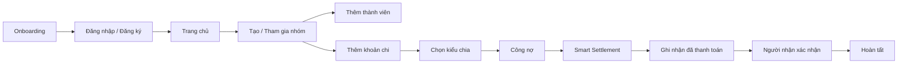
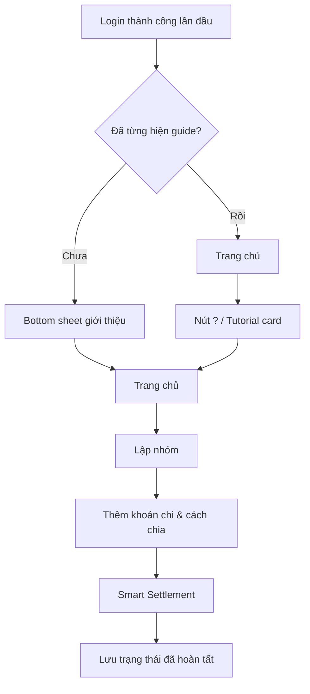

# SplitDebt UI/UX Upgrade Notes

## Mục tiêu

1. Người mới hiểu được ứng dụng trong vài phút đầu.
2. Mọi thao tác quan trọng có phản hồi thành công/thất bại rõ ràng.
3. Tăng chiều sâu thị giác bằng glass, gradient, shadow và 3D hover có kiểm soát.
4. Không thay đổi nghiệp vụ hoặc contract API hiện có.

## Flow chính

## Tutorial flow

## Manual UI checklist

- [ ] Onboarding hiển thị đủ 4 trang và nút Bỏ qua/Tiếp tục.
- [ ] Login/Register không overflow ở màn hình nhỏ và bàn phím mở.
- [ ] Register success dialog hiển thị đúng.
- [ ] Sau login lần đầu có prompt hướng dẫn nhanh.
- [ ] Nút `?` mở lại tutorial bất kỳ lúc nào.
- [ ] Tạo nhóm / join group có feedback success.
- [ ] Add expense hiển thị mô tả đúng khi đổi EQUAL/AMOUNT/PERCENT/WEIGHT/ITEM.
- [ ] Validation lỗi dùng banner đỏ, không chỉ log console.
- [ ] Settlement success/cancel/error có trạng thái khác nhau.
- [ ] Notifications phân biệt Mới/Đã đọc.
- [ ] Dark mode giữ contrast và card không bị chìm nền.
- [ ] Web/desktop hover có lift/tilt; mobile press vẫn tự nhiên.
- [ ] Bật Reduce Motion thì các animation quan trọng giảm/tắt.
